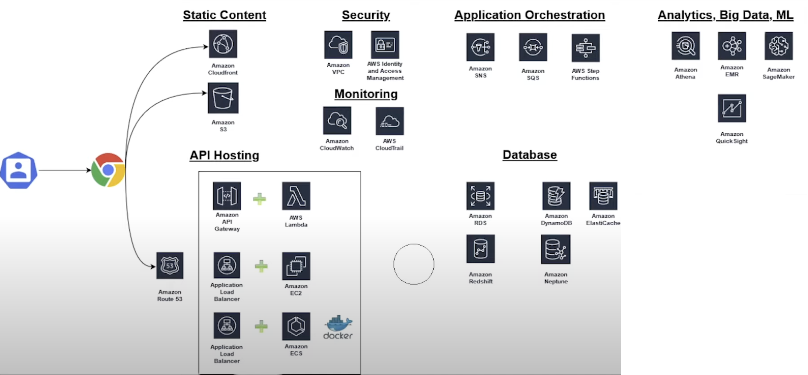

# AWS Services

### Hosting and Static Content

- **Amazon S3**: Used for hosting static content like JavaScript, CSS, HTML, images, and SVGs. It serves as a general-purpose object storage solution.
- **Amazon CloudFront**: Implements edge caching to optimize performance and latency globally. It's integrated with Amazon S3 for content delivery.

### Domain Management and DNS

- **Amazon Route 53**: Manages domain registration, DNS settings, and API routing.

### API Hosting

- **API Gateway and AWS Lambda**: Facilitates serverless management of REST APIs. AWS Lambda handles automatic scaling and provisioning in conjunction with API Gateway.
- **Application Load Balancer and Amazon EC2**: Traditional server-based setup using EC2 instances, with an Application Load Balancer to manage traffic.
- **Application Load Balancer and Amazon ECS**: For Docker-based environments, using ECS for Docker container management and ALB for load balancing.

### Database Services

- **Amazon RDS**: Offers both managed and unmanaged SQL database services. Includes Amazon Aurora for serverless SQL database solutions.
- **Amazon Redshift**: Used for heavy-duty BI queries and analytics, ideal for processing large data sets.
- **Amazon DynamoDB**: A NoSQL database service known for fast performance and horizontal scalability.
- **Amazon ElastiCache**: Provides caching solutions, supporting Memcached and Redis for key-value lookups and other data structures.

### Application - **API Gateway and AWS Lambda**: Facilitates serverless management of REST APIs. AWS Lambda handles automatic scaling and provisioning in conjunction with API Gateway.

- **Amazon SNS and SQS**: Used for asynchronous communication in service-oriented architectures.
- **AWS Step Functions**: Manages workflow processing for sequential tasks.

### Analytics and BI

- **Amazon Athena**: Serverless query service for data analysis stored in S3 using SQL.
- **Amazon EMR (Elastic MapReduce)**: Handles big data processing and MapReduce jobs.
- **Amazon SageMaker**: Facilitates building, training, and deploying machine learning models.

### Security

- **Amazon VPC**: Provides network isolation and security, functioning as a digital firewall for AWS resources.
- **AWS Identity and Access Management (IAM)**: Manages access control for AWS resources, defining permissions and roles.

### Monitoring

- **Amazon CloudWatch**: Monitors AWS resources and applications, managing logs, events, and alarms.
- **AWS CloudTrail**: Maintains an audit trail for user activity and API usage within AWS.
